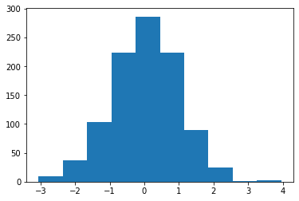
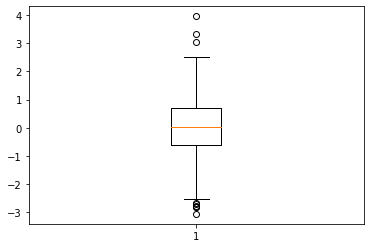
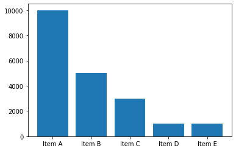
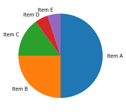
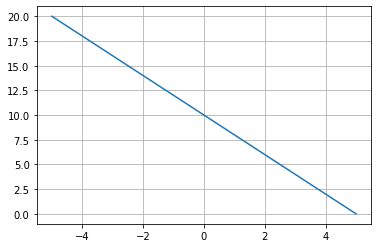
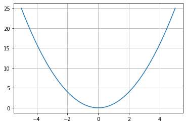

# エクササイズ - matplotlib

## mat_ex01.py

次の実行結果となるようにPythonプログラムを作成してください。

### 実行結果

``` text
$ python mat_ex01.py
```



### ヒント

``` python
import numpy as np
import matplotlib.pyplot as plt

np.random.seed(1)
x = np.random.randn(1000)

# TODO
```

---

## mat_ex02.py

次の実行結果となるようにPythonプログラムを作成してください。

### 実行結果

``` text
$ python mat_ex02.py
```



### ヒント

``` python
import numpy as np
import matplotlib.pyplot as plt

np.random.seed(1)
x = np.random.randn(1000)

# TODO
```

---

## mat_ex03.py

次の実行結果となるようにPythonプログラムを作成してください。

### 実行結果

``` text
$ python mat_ex03.py
```



### ヒント

``` python
import numpy as np
import matplotlib.pyplot as plt

sales = np.array([10000, 5000, 3000, 1000, 1000])
sales_label = np.array(["Item A", "Item B", "Item C", "Item D", "Item E"])

# TODO
```

---

## mat_ex04.py

次の実行結果となるようにPythonプログラムを作成してください。

### 実行結果

``` text
$ python mat_ex04.py
```



### ヒント

``` python
import numpy as np
import matplotlib.pyplot as plt

sales = np.array([10000, 5000, 3000, 1000, 1000])
sales_label = np.array(["Item A", "Item B", "Item C", "Item D", "Item E"])

# TODO
```

---

## mat_ex05.py

次の実行結果となるようにPythonプログラムを作成してください。

### 実行結果

``` text
$ python mat_ex05.py
```



### ヒント

``` python
import numpy as np
import matplotlib.pyplot as plt

x = np.linspace(-5, 5, 100)

# TODO 
```

> 一次関数 y = -2x + 10 のグラフを描画します。

---

## mat_ex06.py

次の実行結果となるようにPythonプログラムを作成してください。

### 実行結果

``` text
$ python mat_ex06.py
```



### ヒント

``` python
import numpy as np
import matplotlib.pyplot as plt

x = np.linspace(-5, 5, 100)

# TODO
```

> 二次関数 y = x^2 のグラフを描画します。

---

## mat_ex07.py

次の実行結果となるようにPythonプログラムを作成してください。

### 実行結果

``` text
$ python mat_ex07.py
```


### ヒント

``` python
import numpy as np
import matplotlib.pyplot as plt

math = np.array([60, 70, 66, 88, 82, 75, 90, 72, 48, 52])
science = np.array([66, 64, 76, 92, 90, 75, 84, 70, 40, 48])

# TODO
```

> 散布図にタイトル、Xラベル、Yラベル、グリッドを表示します。またX軸の表示範囲を0〜100、Y軸の表示範囲を0〜100とします。

---


## mat_ex08.py

次の実行結果となるようにPythonプログラムを作成してください。

### 実行結果

``` text
$ python mat_ex08.py
```


### ヒント

``` python
import numpy as np
import matplotlib.pyplot as plt

sales = np.array([5000, 3000, 2000])
sales_label = np.array(["A", "B", "C"])

# TODO
```

> 1つのウィンドウに2つのグラフを表示します。

---
