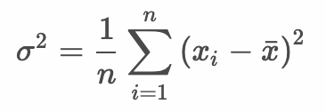
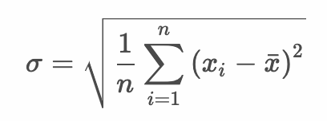
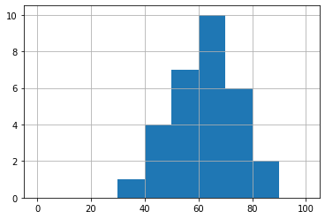
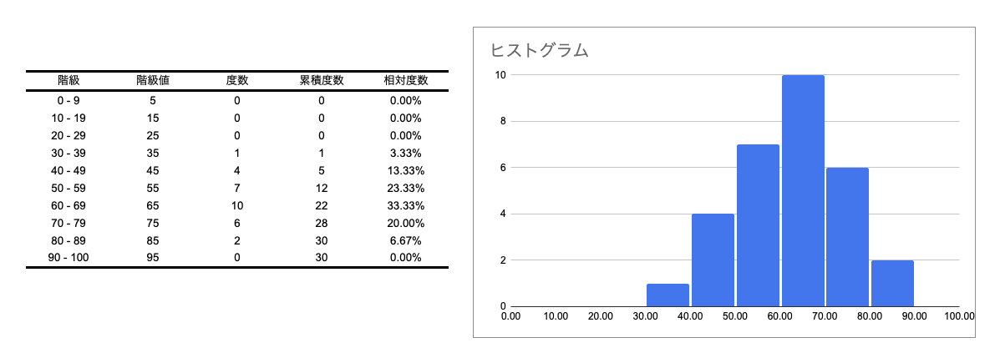
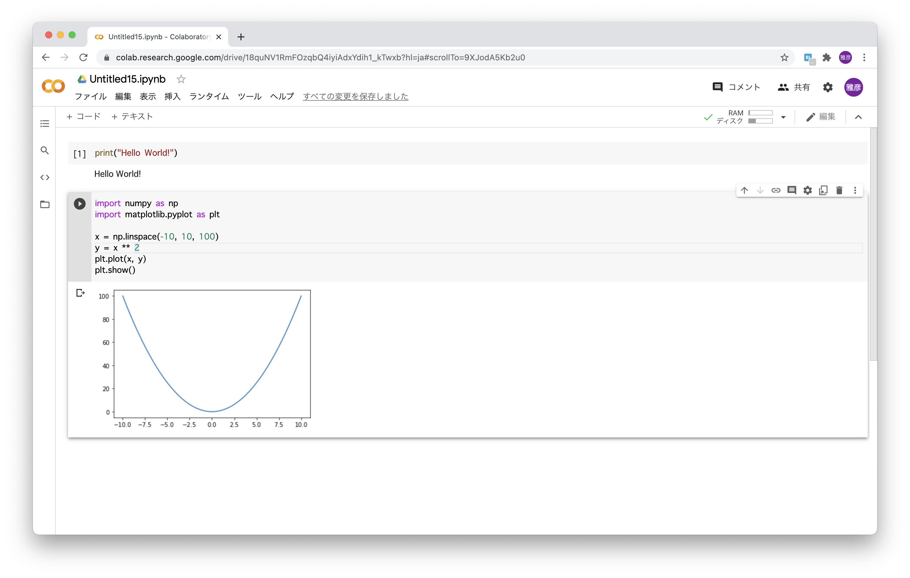
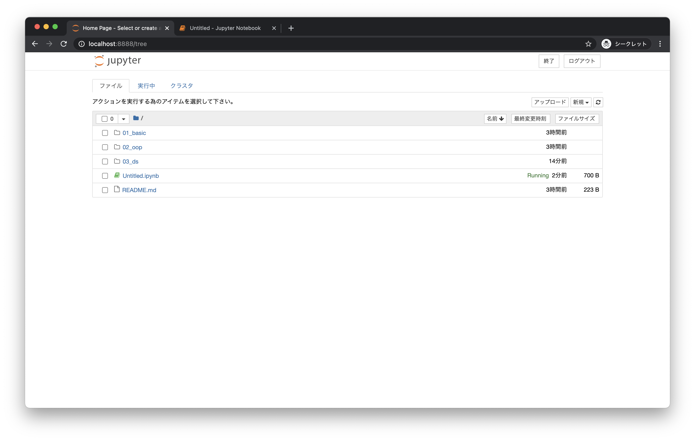
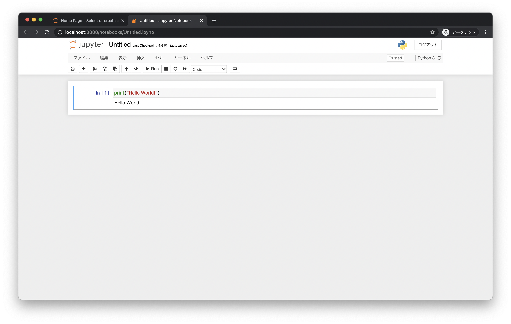

# データサイエンス入門

## 学習の目的

* Pythonプログラミングを応用してデータ解析に取り組む
* NumPy, matplotlib, pandasといったデータ解析ライブラリの使い方を習得する
* scikit-learnによる機械学習プログラミングを体験する


### データサイエンス入門に必要な知識

* Pythonプログラミング
* 平均、標準偏差、正規分布といった記述統計
* Google Colabのようなデータ解析ツール

---

## 記述統計の基礎知識

* 記述統計とは収集したデータからその特徴や傾向を分析する技術
* データの代表値（最小値、最大値、平均値）を求めたり、ばらつき具合を示す分散や標準偏差を求めたり、あるいはグラフにすることでデータの傾向を把握する
* データから意味のある情報を見出す

> 記述統計と比較する言葉に確率論を応用する推測統計があります。ここでは記述統計を中心に学習します。

---

## 平均と標準偏差

* 平均：データの中間的な値
* 標準偏差：データのばらつき具合
* 平均だけではデータのばらつき具合を表現できない


```python
def print_mean(data):
  print(round(sum(data) / len(data)))

def print_std(data):
  mean = sum(data) / len(data)
  total = 0
  for e in data:
    total += (mean - e) ** 2
  print(round((total / len(data)) ** 0.5, 2))

x = [85, 71, 74, 48, 86, 59, 63, 71, 71, 39,  
     64, 61, 73, 64, 75, 57, 59, 63, 58, 63, 
     49, 64, 59, 57, 58, 48, 64, 61, 63, 49]

print_mean(x)
print_std(x)
```

### 実行結果

```text
63
10.27
```

### 参考：数式

平均：


分散：



標準偏差：



---

## 度数分布表とヒストグラム

* 度数：データの出現回数
* 度数分布表：度数の分布を表にしたもの
* ヒストグラム：度数分布表をグラフで表したもの

```python
import matplotlib.pyplot as plt

def print_freq(data):
  width = [0, 10, 20, 30, 40, 50, 60, 70, 80, 90, 100]
  for i in range(len(width)):
    if i == len(width) - 1:
      break
    
    w1 = width[i]
    if i == len(width) - 2:
      w2 = width[i + 1]  
    else:
      w2 = width[i + 1] - 1
    freq = 0
    for e in data:
      if w1 <= e and e <= w2:
        freq = freq + 1
    print(f"{w1} - {w2}: {freq}")

def show_hist(data):
  width = [0, 10, 20, 30, 40, 50, 60, 70, 80, 90, 100]
  plt.grid()
  plt.hist(data, bins=width)
  plt.show()


x = [85, 71, 74, 48, 86, 59, 63, 71, 71, 39,  
     64, 61, 73, 64, 75, 57, 59, 63, 58, 63, 
     49, 64, 59, 57, 58, 48, 64, 61, 63, 49]

print_freq(x)
show_hist(x)
```

### 実行結果

```text
0 - 9: 0
10 - 19: 0
20 - 29: 0
30 - 39: 1
40 - 49: 4
50 - 59: 7
60 - 69: 10
70 - 79: 6
80 - 89: 2
90 - 100: 0
```



### 参考：度数分布表とヒストグラムの例



> 度数分布表には度数以外にも累積度数や相対度数などを出力することもあります。

---

## Google Colaboratory



> Colaboratory（Colab）はブラウザから Python を記述、実行できるサービスです。

+ 環境構築が不要
+ GPU への無料アクセス
+ 簡単に共有

https://colab.research.google.com/notebooks/welcome.ipynb?hl=ja


### 参考 Jupyter Notebook





> Pythonには、Jupyter Notebook というデータ解析ツールが用意されています。Pythonのライブラリ管理ツールpipを使ってJupyter Notebookをインストールできます。

```
$ pip install jupyter
```

> 講義内では主にGoogle Colabを使って学習します。

---

## 演習

* [エクササイズ - データサイエンス入門](../ex/00_ex.md)
