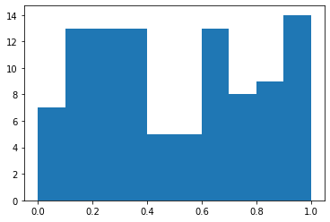
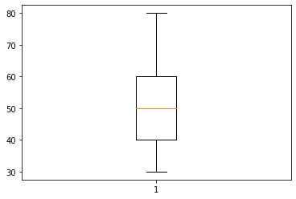
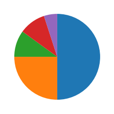
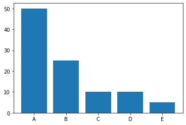
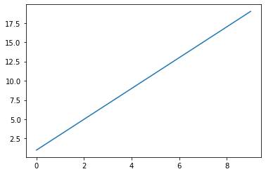
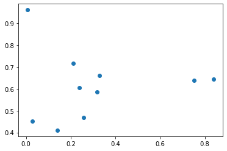
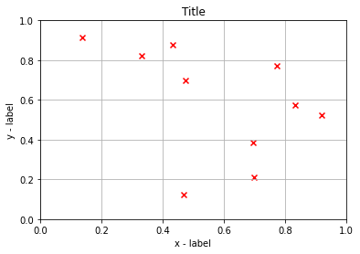
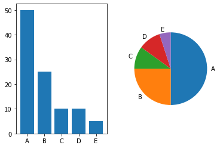

# Matplotlib

## グラフの描画

### `mat01.py`

``` py
import numpy as np
import matplotlib.pyplot as plt

count = 100
x = np.random.rand(count)
# x = np.random.randn(count)
plt.hist(x)
plt.show()
```

### 実行結果

``` text
$ python mat01.py
```



### 解説

* Matplotlibはグラフを描画するライブラリ
* `import matplotlib.pyplot as plt` のようにimportして使用する
* `plt.hist` 関数によってヒストグラムを描画できる

> 乱数の生成部分を `x = np.random.randn(count)` と変更するとどうなるか考察してみましょう。また変数 `count` を大きくするとどうなるかも調べてみましょう。

---

### `mat02.py`

``` py
import numpy as np
import matplotlib.pyplot as plt

x = np.array([30, 40, 50, 60, 80])
print(np.average(x))
plt.boxplot(x)
plt.show()
```

### 実行結果

``` text
$ python mat02.py
```



### 解説

* `plt.boxplot` 関数によって箱ひげ図を描画できる
* 箱ひげ図は、箱の部分で四分位数（25パーセンタイル、50パーセンタイル、75パーセンタイル）を表現する
* 箱ひげ図は、ひげの部分で最小値、最大値を表現する

> ひげの範囲（最大値、最小値）が、箱の範囲（四分位範囲：75パーセンタイル - 25パーセンタイルの範囲）の1.5倍を超える場合は外れ値となります。変数 `x` の最後の要素の値を `80` から `100` に変更してみましょう。

---

### `mat03.py`

``` py
import numpy as np
import matplotlib.pyplot as plt

x = np.array([50, 25, 10, 10, 5])
plt.pie(x, counterclock=False, startangle=90)
plt.show()
```

### 実行結果

``` text
$ python mat03.py
```



### 解説

* `plt.pie` 関数によって円グラフを描画できる。
* 円グラフはデフォルトで3時の方向から反時計回りに描画される
* このプログラムでは`counterclock=False` によって時計まわりに、`startangle=90`によって0時の地点からグラフを描画している

> Matplotlibには `hist` 関数、 `boxplot` 関数、 `pie` 関数など様々な関数が用意されています。これらの関数は引数によって表示をカスタマイズできます。 詳細についてはマニュアルページを参照してください。 https://matplotlib.org/3.3.3/api/_as_gen/matplotlib.pyplot.html

---

### `mat04.py`

``` py
import numpy as np
import matplotlib.pyplot as plt

x = ["A", "B", "C", "D", "E"]
y = np.array([50, 25, 10, 10, 5])
plt.bar(x, y)
plt.show()
```

### 実行結果

``` text
$ python mat04.py
```



### 解説

* `plt.bar` 関数によって棒グラフを描画できる
* `plt.bar` 関数は引数にx座標、y座標の2つの値を受け取る
* MatplotlibはNumPy配列に限らず、通常のリストやタプルを処理できる

---

### `mat05.py`

``` py
import numpy as np
import matplotlib.pyplot as plt

x = np.arange(0, 10)
y = 2 * x + 1
# print(x)
# print(y)
plt.plot(x, y)
plt.show()
```

### 実行結果

``` text
$ python mat05.py
```



### 解説

* `plt.plot` 関数によって折れ線グラフを描画できる
* `plt.plot` 関数は引数にx座標、y座標の2つの値を受け取る
* このプログラムではNumPy配列によりx座標値とy座標値の2つを演算で求めている

---

### `mat06.py`

``` py
import numpy as np
import matplotlib.pyplot as plt

x = np.random.rand(10)
y = np.random.rand(10)
# print(x)
# print(y)
plt.scatter(x, y)
plt.show()
```

### 実行結果

``` text
$ python mat06.py
```



### 解説

* `plt.scatter` 関数によって散布図を描画できる
* `plt.scatter` 関数は引数にx座標、y座標の2つの値を受け取る
* このプログラムではNumPy配列によりx座標値とy座標値の2つを乱数としている

---

### `mat07.py`

``` py
import numpy as np
import matplotlib.pyplot as plt

x = np.random.rand(10)
y = np.random.rand(10)
plt.title("Title")
plt.xlabel("x - label")
plt.ylabel("y - label")
plt.xlim(0, 1)
plt.ylim(0, 1)
plt.grid()
plt.scatter(x, y, color="red", marker="x")
plt.show()
```

### 実行結果

``` text
$ python mat07.py
```



### 解説

* Matplotlibはグラフ描画をカスタマイズできる
* `plt.title` はグラフ上部のタイトル、`plt.xlabel`はX軸のラベル、`plt.ylabel`はY軸のラベルを表示する
* `plt.xlim` はX軸の表示範囲、`plt.ylim`はY軸の表示範囲、`plt.grid()`はグリッド（格子状の罫線）を表示する

### `mat08.py`

``` py
import numpy as np
import matplotlib.pyplot as plt

x = ["A", "B", "C", "D", "E"]
y = np.array([50, 25, 10, 10, 5])

figure = plt.figure()

axes1 = figure.add_subplot(1, 2, 1)
axes1.bar(x, y)

axes2 = figure.add_subplot(1, 2, 2)
axes2.pie(y, labels=x, counterclock=False, startangle=90)

plt.show()
```

### 実行結果

``` text
$ python mat08.py
```



### 解説

* 1つのウィンドウに複数のグラフを描画できる
* `plt.figure()` でグラフの基盤となるオブジェクト（ウィンドウ）を取得できる
* `figure.add_subplot(1, 2, 1)` は引数に1枚のウィンドウに表示する行数、列数、表示位置を指定し、戻り値にaxes（座標軸）に対してグラフを描画する

---

## 演習

* [エクササイズ - Matplotlib](../ex/02_ex.md)
