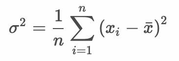
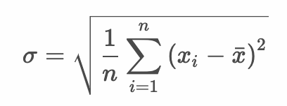
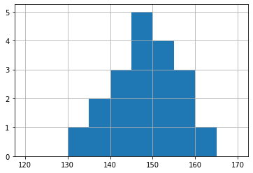

# トレーニング - データサイエンス入門

## ds_tr01.py

次の実行結果となるようにPythonプログラムを作成してください。

### 実行結果

``` text
$ python ds_tr1.py
Min: 132
Max: 161
Median: 146
Mean: 147.42
Var: 57.82
Std: 7.6
```

> 配列変数 `x` の最小値、最大値、中央値、平均値、分散、標準偏差を出力します。

### ヒント

``` python
def print_min(data):
  # TODO

def print_max(data):
  # TODO

def print_median(data):
  # TODO

def print_mean(data):
  # TODO

def print_var(data):
  # TODO

def print_std(data):
  # TODO

x = [150, 145, 132, 142, 146, 161, 142, 137, 141, 152, 
     159, 157, 150, 151, 146, 146, 149, 157, 138]

print_min(x)
print_max(x)
print_median(x)

print_mean(x)
print_var(x)
print_std(x)
```

### 参考：数式

平均：


分散：



標準偏差：



---

## ds_tr02.py

次の実行結果となるようにPythonプログラムを作成してください。

### 実行結果

``` text
$ python ds_tr2.py
120 - 124: 0, 0
125 - 129: 0, 0
130 - 134: 1, 1
135 - 139: 2, 3
140 - 144: 3, 6
145 - 149: 5, 11
150 - 154: 4, 15
155 - 159: 3, 18
160 - 164: 1, 19
165 - 170: 0, 19
```



> 実行結果には、階級と度数、累積度数を出力しています。

### ヒント

``` python
import matplotlib.pyplot as plt

def print_freq(data):
  width = [120, 125, 130, 135, 140, 145, 150, 155, 160, 165, 170]
  # TODO


def show_hist(data):
  width = [120, 125, 130, 135, 140, 145, 150, 155, 160, 165, 170]
  plt.grid()
  plt.hist(data, bins=width)
  plt.show()

x = [150, 145, 132, 142, 146, 161, 142, 137, 141, 152, 
     159, 157, 150, 151, 146, 146, 149, 157, 138]

print_freq(x)
show_hist(x)
```

> 度数分布表の出力部分を実装してください。

---

