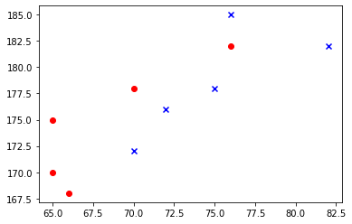
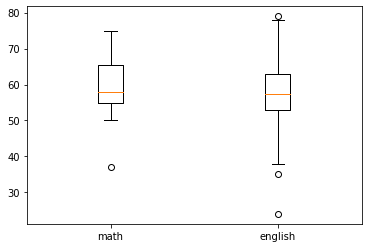
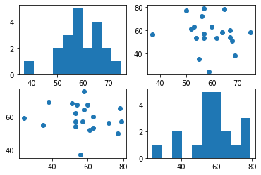
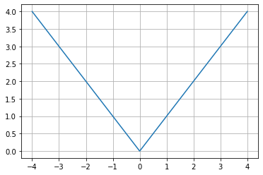

# トレーニング - matplotlib

## mat_tr01.py

次の実行結果となるようにPythonプログラムを作成してください。

### 実行結果

``` text
$ python mat_tr01.py
```


> Colab上で実行しても構いません。

### ヒント

``` python
import numpy as np
import matplotlib.pyplot as plt

x = np.linspace(-4, 4, 100)

# TODO
```

> y = - x**2 のグラフを描画します。

---

## mat_tr02.py

次の実行結果となるようにPythonプログラムを作成してください。

### 実行結果

``` text
$ python mat_tr02.py
```


### ヒント

``` python
import numpy as np
import matplotlib.pyplot as plt

x = np.linspace(-3, 3, 100)

# TODO
```

> x から y を求める関数も考えてみましょう。

---

## mat_tr03.py

次の実行結果となるようにPythonプログラムを作成してください。

### 実行結果

``` text
$ python mat_tr03.py
```


### ヒント

``` python
import numpy as np
import matplotlib.pyplot as plt

x = np.linspace(0, 8, 100)

# TODO
```

> NumPyに用意されている対数関数を使います。

---

## mat_tr04.py

次の実行結果となるようにPythonプログラムを作成してください。

### 実行結果

``` text
$ python mat_tr04.py
```



### ヒント

``` python
import numpy as np
import matplotlib.pyplot as plt

x1 = [65, 76, 65, 70, 66]
y1 = [170, 182, 175, 178, 168]

x2 = [75, 76, 82, 70, 72]
y2 = [178, 185, 182, 172, 176]

# TODO
```

> x1, y1の座標を赤い丸、x2,y2の座標を青いバツで表示します。

---

## mat_tr05.py

以下のデータを `exam.csv` として用意します。

```csv
id,math,english
1,50,77
2,67,60
3,68,51
4,59,24
5,55,35
6,52,61
7,57,57
8,57,53
9,62,53
10,75,58
11,53,63
12,37,56
13,69,38
14,60,63
15,57,79
16,54,53
17,67,54
18,65,78
19,64,58
20,56,72
```

CSVファイルの内容は、Google Colab上で、以下のwgetコマンドを実行して取得できます。

```text
!wget https://gist.githubusercontent.com/murayama333/68b260d83b98c58dd0b328550e7504a0/raw/5a92368cead833690349148c4c146f9d38518c8a/exam.csv
```


次の実行結果となるようにPythonプログラムを作成してください。

### 実行結果

``` text
$ python mat_tr05.py
```



### ヒント

``` python
import numpy as np
import matplotlib.pyplot as plt

exam = np.loadtxt("exam.csv", delimiter=",", skiprows=1)

# TODO
```

> print(exam)としてデータの内容を確認してみましょう。それから箱ひげ図として出力してください。

---

## mat_tr06.py

次の実行結果となるようにPythonプログラムを作成してください。

### 実行結果

``` text
$ python mat_tr06.py
```



### ヒント

``` python
import numpy as np
import matplotlib.pyplot as plt

exam = np.loadtxt("exam.csv", delimiter=",", skiprows=1)

```

> 1つのウィンドウに4つ（2 x 2）のグラフを描画します。左上は `math` データのヒストグラム、右下は `english` データのヒストグラムです。 右上の散布図はx軸に `math` , y軸に `english` を表示しており、左下の散布図はx軸に `english` , y軸に `math` を表示しています。

---

## mat_tr07.py

次の実行結果となるようにPythonプログラムを作成してください。

### 実行結果

``` text
$ python mat_tr07.py
```



### ヒント

``` python
import numpy as np
import matplotlib.pyplot as plt

x = np.linspace(-4, 4, 1000)

# TODO
```

---
